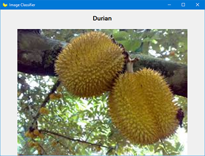
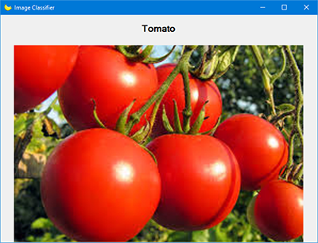

# SimpleImageClassifier
A simple image classifier in C# without using any external library. It uses a 1NN classifier with colour histograms as features. It is just a proof of concept. It can detect bananas, tomatos, blueberries, and durians.

